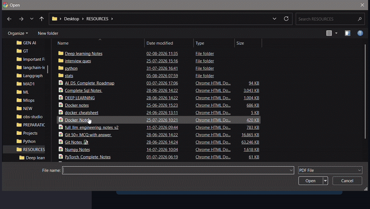
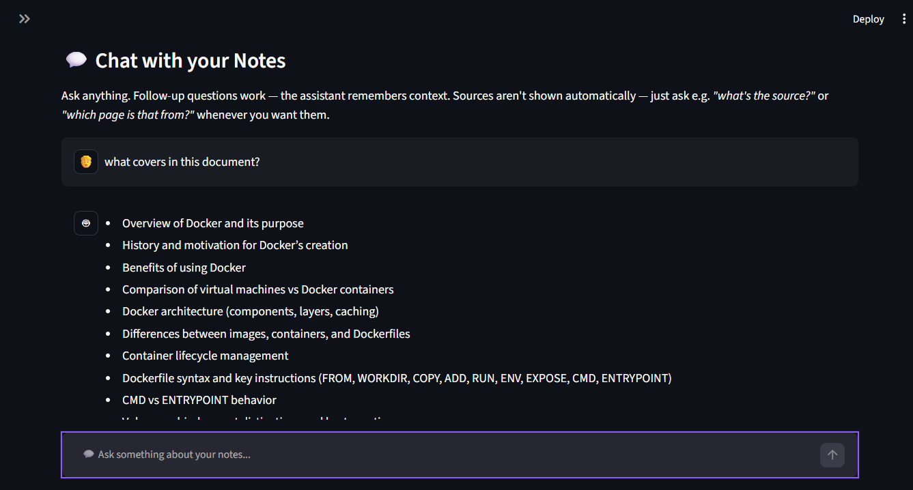
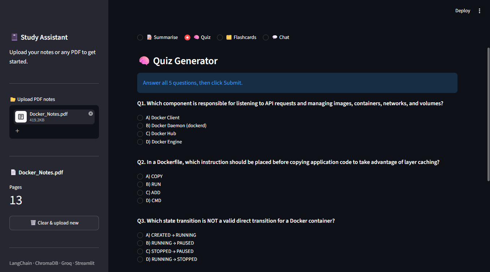
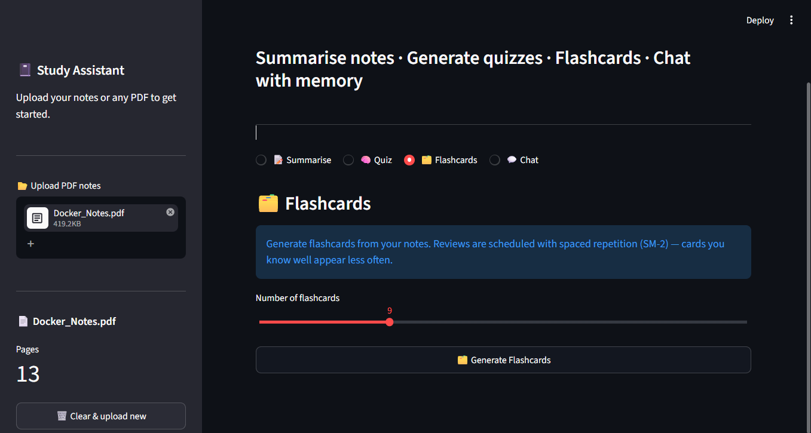
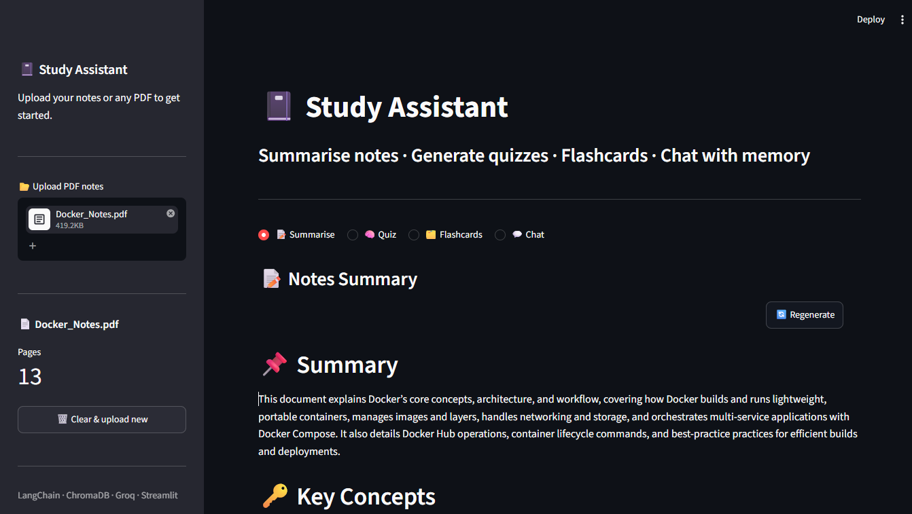

<div align="center">

# 🎓 Study Assistant

### AI-Powered PDF Study Workspace

**Turn your PDF notes into summaries, quizzes, flashcards, and a history-aware RAG chat assistant.**

Built with **LangChain · Groq · ChromaDB · HuggingFace Embeddings · Streamlit · RAGAS**

<br>

### 🔗 [Live Demo → study-assistant-ks5o.onrender.com](https://study-assistant-ks5o.onrender.com)

> Hosted on Render's free tier — the app may take ~30–50s to wake up on first load if it's been idle.

<br>



<br>

[](https://github.com/21f3001527/Recall/actions/workflows/evaluation-ci.yml)
[](https://www.python.org/)
[](https://www.langchain.com/)
[](https://streamlit.io/)
[](https://groq.com/)
[](https://www.trychroma.com/)
[](https://docs.astral.sh/uv/)
[](https://www.docker.com/)

</div>

---

## ✨ Overview

**Study Assistant** is an AI-powered learning workspace that transforms PDF study material into an interactive study experience.

Upload a document once and use the same knowledge source to:

- Generate structured summaries
- Ask questions through history-aware RAG chat
- Generate and take quizzes
- Create flashcards with SM-2 spaced repetition
- Track quiz and flashcard progress
- Evaluate each AI pipeline using deterministic checks and LLM-based evaluation
- Run automated evaluation regression checks through GitHub Actions

The project focuses not only on building LLM features, but also on **evaluating and regression-testing them**.

---

## 🚀 Features

| Feature | Description |
|---|---|
| 📝 **Summarization** | Generates structured summaries from long PDF documents |
| 💬 **RAG Chat** | History-aware question answering grounded in the uploaded document |
| 📄 **Source References** | Chat responses include the relevant document page references |
| 🧠 **Quiz Generation** | Generates MCQs and tracks scores across attempts |
| 🗂️ **Flashcards** | Generates Q&A cards and schedules reviews using SM-2 |
| ⚡ **Persistent Vector Store** | ChromaDB stores document embeddings and avoids unnecessary re-embedding |
| 💾 **Persistent Study Data** | SQLite stores quiz history and flashcard scheduling data |
| 📊 **Evaluation Framework** | RAGAS, deterministic checks, and LLM-as-Judge evaluation |
| 🔄 **CI Regression Testing** | GitHub Actions validates evaluation results automatically |

---

## 🖥️ Application

Upload a PDF and use the same document across all four study workflows.

### 💬 RAG Chat

History-aware conversations grounded in the uploaded document, with source-page references.



---

### 🧠 Quiz

Automatically generated multiple-choice questions with persistent score history.



---

### 🗂️ Flashcards

Generated Q&A cards with **SM-2 spaced-repetition scheduling**.



---

### 📝 Summary

Structured summaries generated from the uploaded PDF.



---

## 🛠️ Tech Stack

| Category | Technology | Purpose |
|---|---|---|
| **Language** | Python 3.12 | Application development |
| **LLM Orchestration** | LangChain | LLM workflows and chains |
| **LLM Inference** | Groq | Fast LLM inference |
| **Embeddings** | HuggingFace Embeddings | Local document embeddings |
| **Vector Store** | ChromaDB | Persistent semantic retrieval |
| **Database** | SQLite | Quiz history and flashcard scheduling |
| **UI** | Streamlit | Interactive study interface |
| **Evaluation** | RAGAS + LLM-as-Judge | LLM/RAG quality evaluation |
| **Package Management** | uv | Dependency and environment management |
| **Containerization** | Docker + Docker Compose | Reproducible local runtime and deployment |
| **Deployment** | Render (Docker Web Service) | Hosting the live demo |
| **CI/CD** | GitHub Actions | Automated regression testing |

---

## 🏗️ Architecture

```text
                         ┌──────────────────────┐
                         │       PDF Upload      │
                         └──────────┬───────────┘
                                    │
                                    ▼
                         ┌──────────────────────┐
                         │     PDF Loader        │
                         └──────────┬───────────┘
                                    │
                                    ▼
                         ┌──────────────────────┐
                         │  Chunking / Parsing   │
                         └──────────┬───────────┘
                                    │
                                    ▼
                         ┌──────────────────────┐
                         │ HuggingFace Embeddings│
                         └──────────┬───────────┘
                                    │
                                    ▼
                         ┌──────────────────────┐
                         │       ChromaDB        │
                         │   Persistent Vectors  │
                         └──────────┬───────────┘
                                    │
              ┌─────────────────────┼─────────────────────┐
              │                     │                     │
              ▼                     ▼                     ▼
       ┌─────────────┐       ┌─────────────┐       ┌─────────────┐
       │  RAG Chat   │       │  Summary    │       │    Quiz     │
       └──────┬──────┘       └──────┬──────┘       └──────┬──────┘
              │                     │                     │
              │                     │                     │
              ▼                     ▼                     ▼
       ┌────────────────────────────────────────────────────────┐
       │                        Groq LLM                        │
       └────────────────────────────────────────────────────────┘
                                    │
                                    ▼
                            ┌──────────────┐
                            │  Flashcards  │
                            │    + SM-2    │
                            └──────┬───────┘
                                   │
                                   ▼
                            ┌──────────────┐
                            │    SQLite    │
                            │  Study Data  │
                            └──────────────┘
```

Conversation history is used to reformulate follow-up questions before retrieval. The retriever then selects the most relevant document chunks, which are passed to the Groq LLM to generate a grounded response.

```text
User Question
      │
      ▼
Conversation History
      │
      ▼
Question Reformulation
      │
      ▼
ChromaDB Retriever
      │
      ▼
Top-K Relevant Chunks
      │
      ▼
Groq LLM
      │
      ▼
Grounded Answer + Source Pages
```

---

## 📊 Evaluation

Each component is evaluated according to its actual failure mode — deterministic structural checks plus LLM-based evaluation (RAGAS for chat, LLM-as-Judge for generated content).

| Component | Results |
|---|---|
| 💬 Chat / RAG | 100% of questions retrieved ≥1 context · Faithfulness 0.87–0.94 · Context Recall 0.91 |
| 🗂️ Flashcards | Faithfulness 5.0/5 · Clarity 5.0/5 · Correctness 5.0/5 · Scope 5.0/5 · Topic coverage 100% |
| 🧠 Quiz | Correctness 5.0/5 · Clarity 5.0/5 · Distractor Quality 5.0/5 · Difficulty 4.0/5 |
| 📝 Summary | Faithfulness 5.0/5 · Coverage 5.0/5 · Conciseness 4.0/5 · Coherence 5.0/5 |

📖 Full methodology, K=4 vs K=6 comparison, evaluation findings, dataset details, and per-component commands: **[EVALUATION.md](EVALUATION.md)**

---

## 🔄 CI / Regression Testing

Evaluation is integrated into GitHub Actions using two tiers.

**Tier 1 — Fast Sanity Checks**

Runs automatically on pushes and pull requests.

- No LLM/API calls
- Validates committed evaluation JSON
- Checks structural integrity
- Detects malformed or unexpected outputs
- Fast and inexpensive

**Tier 2 — Full Evaluation**

Runs manually or on the scheduled weekly workflow.

- Uses `GROQ_API_KEY` from GitHub Secrets
- Regenerates evaluation results
- Runs RAGAS
- Runs LLM-as-Judge pipelines
- Uploads results as GitHub Actions artifacts
- Does not automatically commit generated results


---

## 📂 Project Structure

```text
Recall/
│
├── app.py
├── config.py
│
├── backend/
│   ├── chat.py
│   ├── db.py
│   ├── document_loader.py
│   ├── flashcards.py
│   ├── models.py
│   ├── quiz.py
│   ├── summarizer.py
│   └── vectorstore.py
│
├── evaluation/
│   ├── dataset/
│   │   ├── chat_eval.json
│   │   ├── flashcards_eval.json
│   │   ├── quiz_eval.json
│   │   └── summary_eval.json
│   │
│   ├── results/
│   │   └── *.json
│   │
│   ├── evaluate_*.py
│   ├── analyze_*_results.py
│   ├── judge_*.py
│   └── ragas_eval_chat.py
│
├── assets/
│   ├── study_assistant_demo.gif
│   ├── study_assistant_chat.png
│   ├── study_assistant_quiz.png
│   ├── study_assistant_flashcards.png
│   ├── study_assistant_summary.png
│   └── github-actions-evaluation.png
│
├── data/
│   ├── chroma_db/
│   └── study_assistant.db
│
├── sample_docs/
│   └── Numpy Notes.pdf
│
├── .github/
│   └── workflows/
│       └── evaluation-ci.yml
│
├── Dockerfile
├── Dockerfile.render
├── docker-compose.yml
├── .dockerignore
├── pyproject.toml
├── uv.lock
├── README.md
└── EVALUATION.md
```

---

## 🚀 Getting Started

**1. Clone the repository**

```bash
git clone <repository-url>
cd Recall
```

**2. Install dependencies**

This project uses `uv` for dependency management.

```bash
uv sync
```

**3. Configure the Groq API key**

Create a `.env` file in the project root:

```
GROQ_API_KEY=your_api_key
```

> Never commit `.env` or API keys to Git.

**4. Run the application**

```bash
uv run streamlit run app.py
```

Open:

```
http://localhost:8501
```

Upload a PDF and start studying.
> Want to run the evaluation suite? See the **[Evaluation Guide](EVALUATION.md)** for per-component commands.

---

## 🐳 Docker

The application is fully containerized. There are two Docker setups in this repo, for two different purposes:

| File | Purpose |
|---|---|
| `Dockerfile` + `docker-compose.yml` | Local development — fixed port `8501`, mounts `./data` as a volume so ChromaDB and SQLite persist across container restarts |
| `Dockerfile.render` | Production deployment on Render — binds dynamically to Render's injected `$PORT` env var |

### Run locally with Docker Compose

```bash
docker compose up --build
```

Open the app at:

```
http://localhost:8501
```

Stop the app:

```bash
docker compose down
```

`GROQ_API_KEY` is loaded from a local `.env` file via `env_file` in `docker-compose.yml`. Study data (vector store + quiz/flashcard history) persists on the host under `./data`, since it's mounted as a volume into the container.

### Deployment (Render)

The [live demo](https://study-assistant-ks5o.onrender.com) runs as a Docker Web Service on Render, built from `Dockerfile.render`:

- Render injects `PORT` at runtime, so the container's `CMD` binds Streamlit to `${PORT:-10000}` instead of a hardcoded port
- `GROQ_API_KEY` is set as an environment variable in Render's dashboard — `config.py` already falls back to `os.getenv("GROQ_API_KEY")` when `st.secrets` isn't available, so no code changes were needed
- The free tier has no persistent disk, so `data/` resets on redeploys/restarts — acceptable for a portfolio demo, since the goal is to showcase functionality rather than long-term storage

---

## 💾 Data Persistence

The application maintains two persistent stores:

```text
data/
├── chroma_db/
│   └── Document embeddings
│
└── study_assistant.db
    ├── Quiz history
    └── Flashcard scheduling
```

To completely reset local application data, delete the `data/` directory. The required stores will be recreated automatically.

> Note: on the Render-hosted live demo, this data does not persist across restarts (see Docker section above).

---

## 🧠 Spaced Repetition

Flashcards use the SM-2 algorithm to schedule future reviews based on performance.

This turns generated flashcards from a one-time activity into a recurring study workflow designed for long-term retention.

---

## 🐛 Troubleshooting

| Problem | Solution |
|---|---|
| `GROQ_API_KEY not found` | Verify that `.env` exists in the project root and contains a valid API key |
| Slow first run | HuggingFace embedding models are downloaded and cached on first use |
| Groq 429 during evaluation | Wait for the rate limit to reset and rerun the evaluation |
| Judge run stops partway | Re-run the judge; completed items are checkpointed |
| Fewer quiz questions than requested | The source document may not contain enough distinct content after duplicate filtering |
| Poor retrieval | Run `analyze_chat_results.py` and inspect the retrieved contexts |
| Live demo is slow to load | Render's free tier sleeps after inactivity; the first request wakes it up and takes ~30–50s |

---

## 🚧 Future Improvements

- [ ] Multi-document RAG
- [ ] Semantic topic-coverage evaluation
- [ ] Human vs. LLM-as-Judge comparison
- [ ] Statistical confidence intervals across repeated evaluations
- [ ] Cost and latency tracking
- [ ] Improved quiz distractor generation
- [ ] Larger and more diverse evaluation datasets
- [ ] Stronger automated CI evaluation gates

---

## 📜 License

For educational purposes.