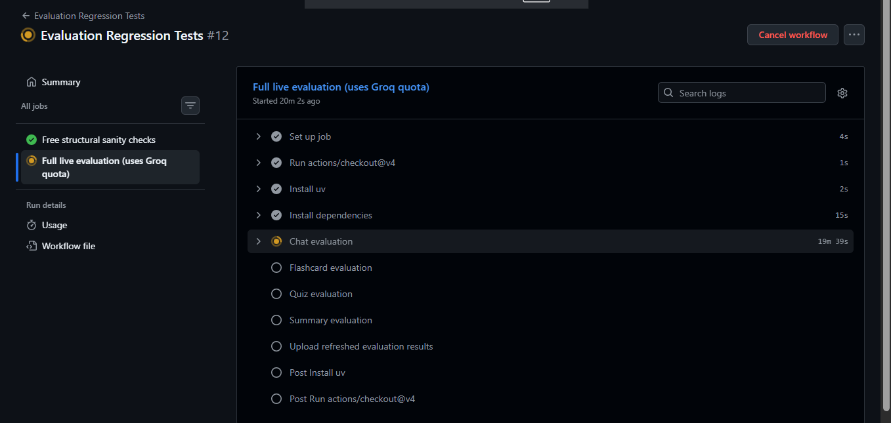

<div align="center">

# 🎓 Study Assistant

**An AI-powered study workspace that turns PDF notes into summaries, quizzes, flashcards, and a history-aware RAG chat assistant.**
<div align="center">

[](https://github.com/21f3001527/Recall/actions/workflows/evaluation-ci.yml)


</div>

</div>

---

## ✨ Features

- 📝 **Summarization** — structured summaries from long PDF notes
- 💬 **RAG Chat** — ask questions about your documents, with source-page references
- 🧠 **Quiz Generation** — auto-generated MCQs with persistent score history
- 🗂️ **Flashcards** — Q&A flashcards with SM-2 spaced repetition
- ⚡ **Persistent Storage** — ChromaDB for embeddings, SQLite for progress
- 📊 **Evaluation Suite** — RAGAS + LLM-as-Judge + CI regression checks

---

## 🛠️ Tech Stack

| Category | Technology |
|---|---|
| Language | Python |
| LLM Orchestration | LangChain |
| LLM Inference | Groq |
| Embeddings | HuggingFace |
| Vector Store | ChromaDB |
| Database | SQLite |
| UI | Streamlit |
| Evaluation | RAGAS, LLM-as-Judge |
| Package Management | uv |
| CI/CD | GitHub Actions |

---

## 🖥️ Application Screenshots

Upload a document and access Chat, Summary, Quiz, and Flashcards from the same knowledge source.

<div align="center">

<table>
<tr>
<td align="center" width="50%">
<br>
<sub><b>RAG Chat</b> — grounded Q&A with source-page references</sub>
</td>
<td align="center" width="50%">
<br>
<sub><b>Quiz</b> — auto-generated MCQs with score history</sub>
</td>
</tr>
<tr>
<td align="center" width="50%">
<br>
<sub><b>Flashcards</b> — SM-2 spaced repetition</sub>
</td>
<td align="center" width="50%">
<br>
<sub><b>Summary</b> — structured notes from your PDF</sub>
</td>
</tr>
</table>

</div>

---

## 🏗️ How It Works

```text
PDF → Loader → Chunking → HuggingFace Embeddings → ChromaDB
                                                        │
                              ┌─────────────┬───────────┼───────────┐
                              ▼             ▼           ▼           ▼
                          RAG Chat      Summary       Quiz     Flashcards
                              │                          └──────┬──────┘
                              ▼                                 ▼
                          Groq LLM                      SQLite + SM-2
```

For RAG Chat, conversation history is used to reformulate follow-up questions before retrieval. The retriever selects the top-K chunks from ChromaDB, which are passed to the Groq LLM to generate a grounded response with source-page references.

---

## 📊 Evaluation

Each component is evaluated according to its failure mode using deterministic checks and LLM-based evaluation.

| Component | Evaluation | Current Results |
|---|---|---|
| 💬 Chat / RAG | Retrieval sanity checks + RAGAS | 100% questions retrieved context (sanity check) · Faithfulness 0.87–0.94 · Context Recall 0.91 (RAGAS) |
| 🗂️ Flashcards | Structural checks + LLM-as-Judge | 5.0/5 across all metrics · 100% topic coverage |
| 🧠 Quiz | Structural checks + LLM-as-Judge | 4.0–5.0/5 · 70% topic coverage · 22 unique questions |
| 📝 Summary | Structural checks + LLM-as-Judge | Faithfulness 5.0/5 · Coverage 5.0/5 · ~9.4% compression ratio |

### Key Findings

- Deterministic checks caught near-duplicate quiz options that the LLM judge rated highly.
- Keyword-based topic matching produced a false negative (`reshape` vs `reshaping`).
- Increasing retrieval from K=4 to K=6 did not improve recall, so K=4 was retained.
- Quiz generation reached 22 unique questions because duplicate filtering rejected repeated content from the small source document.

### Evaluation Commands

Pattern is the same for `chat`, `flashcards`, `quiz`, `summary`:

```bash
uv run python -m evaluation.evaluate_<component>
uv run python -m evaluation.analyze_<component>_results
uv run python -m evaluation.judge_<component>       # not used for chat
uv run python -m evaluation.ragas_eval_chat          # chat only
```

Detailed results are stored as JSON under `evaluation/results/`. Quiz/flashcard judging is resumable via checkpointing.

---

## 🔄 CI / Regression Testing

Evaluation results are protected by GitHub Actions using two tiers.

### 1. Sanity Checks — Every Push / PR

- Runs automatically on `main`
- No LLM/API calls
- Validates committed evaluation JSON files
- Checks structural integrity of generated outputs
- Fast and free

### 2. Full Evaluation — Manual / Weekly

- Triggered manually or every Monday
- Uses `GROQ_API_KEY` stored in GitHub Secrets
- Regenerates Chat, Flashcard, Quiz, and Summary evaluations
- Runs RAGAS and LLM-as-Judge pipelines
- Uploads refreshed results as GitHub Actions artifacts
- Does not automatically commit regenerated results



---

## 📂 Project Structure

```text
Recall/
├── app.py
├── config.py
├── backend/                    # chat, quiz, flashcards, summarizer, vectorstore, db
├── evaluation/
│   ├── dataset/                 # eval question sets
│   ├── results/                 # generated JSON evaluation output
│   ├── evaluate_*.py            # generation pipelines
│   ├── analyze_*_results.py     # deterministic checks
│   ├── judge_*.py               # LLM-as-Judge
│   └── ragas_eval_chat.py
├── assets/                      # screenshots
├── data/
│   ├── chroma_db/                # embeddings
│   └── study_assistant.db        # quiz + flashcard history
├── sample_docs/
│   └── Numpy Notes.pdf
├── .github/
│   └── workflows/
│       └── evaluation-ci.yml
├── pyproject.toml
├── uv.lock
└── README.md
```

---

## 🚀 Getting Started

```bash
git clone <repository-url>
cd Recall
uv sync

# create .env in project root
echo "GROQ_API_KEY=your_api_key" > .env

uv run streamlit run app.py
# open http://localhost:8501
```

---

## 🐛 Troubleshooting

| Problem | Solution |
|---|---|
| `GROQ_API_KEY not found` | Check `.env` exists and has a valid key |
| Slow first run | HuggingFace embedding models download & cache on first use |
| Groq 429 during evaluation | Wait for rate limit reset and rerun |
| Judge/quiz run stops partway | Re-run — completed items are checkpointed |
| Fewer quiz questions than requested | Source doc lacks enough distinct content after dedup filtering |
| Poor retrieval | Run `analyze_chat_results.py` to inspect retrieved contexts |

---

## 🚧 Future Improvements

- Multi-document RAG
- Semantic topic-coverage matching
- Human vs LLM-judge comparison
- Cost/latency tracking
- Better quiz distractors
- Broader eval datasets

---

## 📜 License

For educational purposes.
